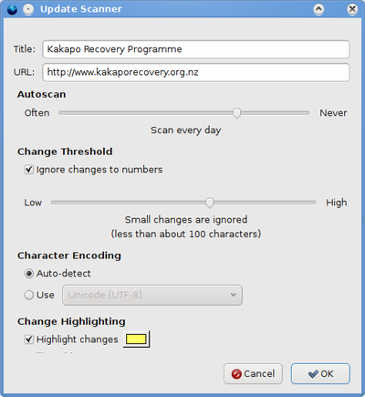

Page Properties
---------------

### Title

Enter a name for the page.

### URL

Enter the URL of the page. This can start with "http://" or "file:///".

### AutoScan

Select how often the page should be scanned for updates. Once every hour is a good setting. If you scan too often, your computer may slow down, or even be banned from some websites.

### Change Threshold

Select how much a page must change in order to be marked as updated.

### Ignore Changes to Numbers

When this option is selected, changes to numbers won't cause a page to be marked as updated.

### Character Encoding

Select "Auto-detect" to automatically select the character encoding based on the page's content.
If this doesn't work, you can also select the encoding type manually.

### Change Highlighting

If selected, webpage changes will be highlighted. Click the colour button to set the highlight colour.
If not selected, the Update Scanner header will not be displayed, and changes will not be highlighted.

### Enable Javascript

Deselect this to disable Javascript when displaying highlighted pages. This can be useful if a page has a script that causes it to "pop out" to the main frame and remove the Update Scanner header.

### Enable Flash and Plugins

Deselect this to disable flash and plugins when displaying highlighted pages.
