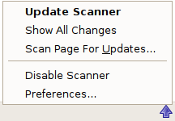

Toolbar Icon
------------

Left-click the arrow icon in the Firefox toolbar to open the Update Scanner sidebar.

Double-click the icon to show all changed pages in a new browser tab.

Right-click the icon to open the statusbar menu:

### Update Scanner

Open the Update Scanner sidebar.

### Show All Changes

Show all changed pages in a new browser tab.

### Scan Page for Updates

Add the current page to the Update Scanner sidebar list.

### Disable/Enable Scanner

Disable or Enable the scanner. If the scanner is disabled, the arrow icon will be crossed out, and automatic scanning will not occur.

### Preferences

Open the preferences dialog.